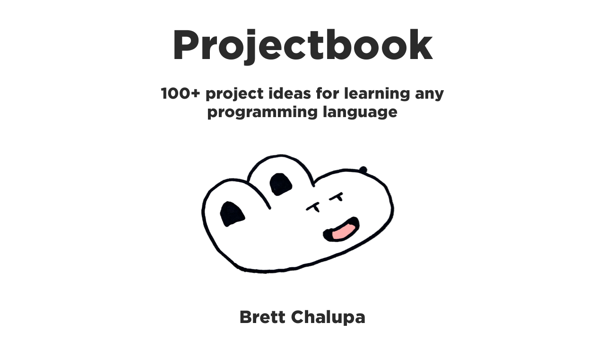

# Projectbook

**Learn By Doing**

A collection of over 100 project ideas for learning new programming languages, frameworks, and libraries.

Browse around, dig in, make something, and share it!

👀📖 [Browse the book!](https://projectbook.code.brettchalupa.com)

[Or download a PDF.](https://github.com/brettchalupa/projectbook/releases)

[Or get involved on GitHub Discussions.](https://github.com/brettchalupa/projectbook/discussions)

---

## Writing & Development Guide

Authored in Markdown with [mdBook](https://rust-lang.github.io/mdBook/).

### Running the Dev Server

[Follow the mdBook instructions.](https://rust-lang.github.io/mdBook/guide/installation.html)

Or install via Cargo if you have Rust installed:

1. [Rust](https://www.rust-lang.org/tools/install)
2. mdbook - `cargo install mdbook`

Run the book server with : `mdbook serve --open`

### Hosting

Hosted on GitHub Pages, deployed via [GitHub Action](https://github.com/peaceiris/actions-mdbook) when pushed to `main` branch.
