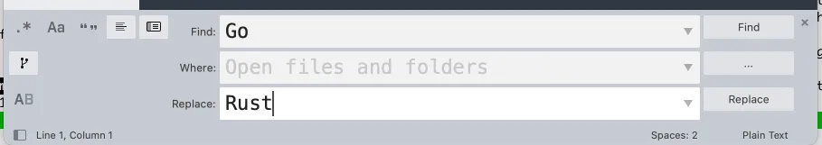

# Find and Replace (far)

As a Vim user, I'm pretty much always sweating large scale find and replace in my code. I'm going to be honest with you, I usually open up Sublime just for this since it's easy and works well. I know, I know, I'm probably doing Vim wrong.

But you know what? I'm over that! Well, I want to be over that. That's where this project comes into play.

I call it `far` in my head, for "(f)ind (a)nd (r)eplace".

I think about it as a command-line app, but I think it could also have a graphical desktop wrapper too for those who would want that.

## Example Usage

Replace all instances of "Foo" with "Bar" in the current directory (and its children):

```
far Foo Bar
```

Or specify a glob of files in a given directory:

```
far Foo Bar src/**/*.rs
```

## Spec

- globs
- targeting specific files
- confirm interface
- respect the existing capitalization, like `far foo bar --respect-caps` would do both upper and lowercase variations of the words
- support regex
- do a dry run that outputs what would have changed but without doing it

## Tech On My Mind

Really any programming language would work that can all out to the system IO. But what would make this project really ideal would be the abiliy to compile it easily into a dependency-free cross-platform binary that's easy to distribute.

These are my top runners:
- Go
- Rust

tk-rs for the GUI would, in particular, match well with Rust for the library aspect of this.

## GUI Find and Replace

Here's a screenshot of Sublime's Find and Replace interface:



## Stretch Goals

- Respect the `.gitignore` locally and globally
- Concurrency for files within a directory
- Able to efficiently process extremely large text files
