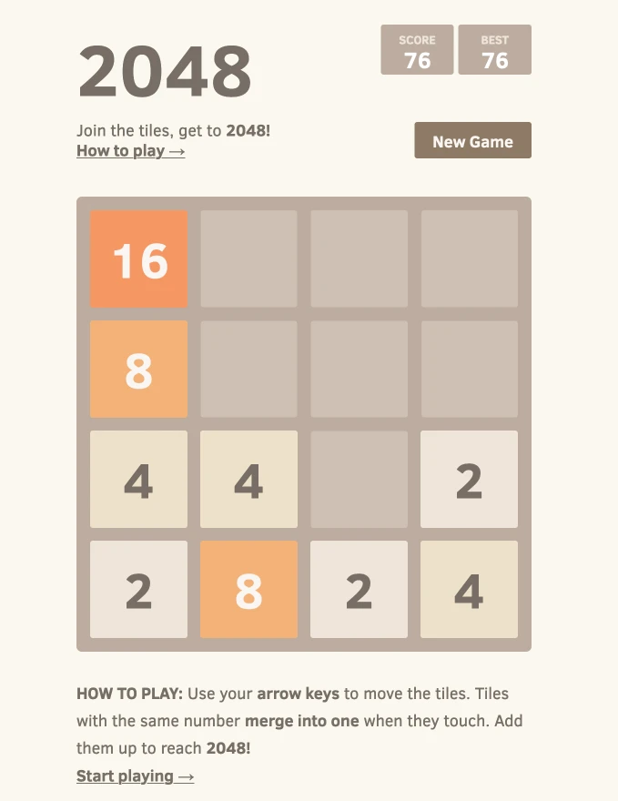

# 2048

**The gist**: build a tile-based puzzle game where you can combine matching tiles.

[Play 2048 in the web.](https://play2048.co/) The best way to get a sense of 2048 is to just play it.

## Mock-Up

Here's a screenshot of the original game for reference:

## Concepts

- Input
- Game logic
- Random spawning

## Resources

- [Wikipedia article on _2048_](https://en.wikipedia.org/wiki/2048_(video_game))
- [Many open source versions exist](https://github.com/search?utf8=%E2%9C%93&q=2048)