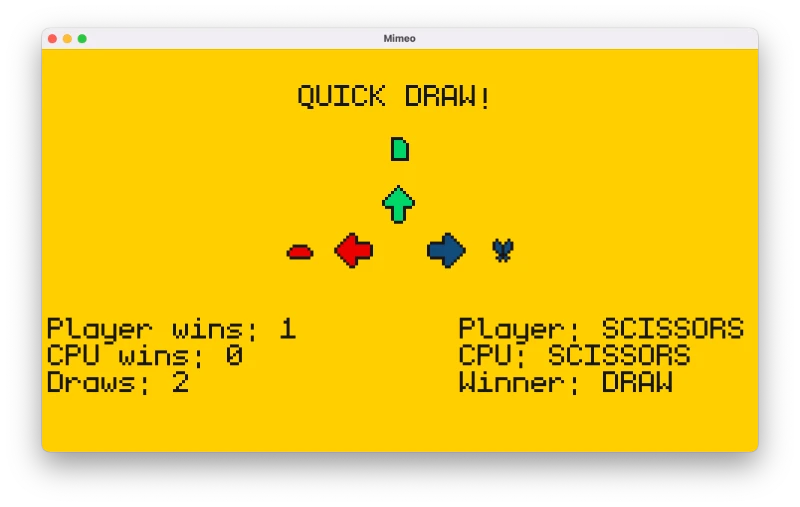

# Rock, Paper, Scissors!

**The gist**: build a digital version of the classic childhood game where each player counts down from three and plays their move. Rock beats scissors. Scissors beats paper. Paper beats rock. Draw if the same.

RPS is a good learning project because the rules are simple but present nonetheless. The idea of three competing elements and determining which one wins out is common in many games.

## Mock-Up

While not particularly thrilling, here's a version of RPS I made that uses the arrow keys for input for rock, paper, or scissors.

## Specs

- Input rock, paper, or scissor (button click or with keys)
- Have the computer randomly choose between the three
- Keep track of who has won how many rounds

## Concepts

- Logic
- Input

## Extra Credit

- Multiplayer support
- Polished animations with the countdown and the display of the winner
