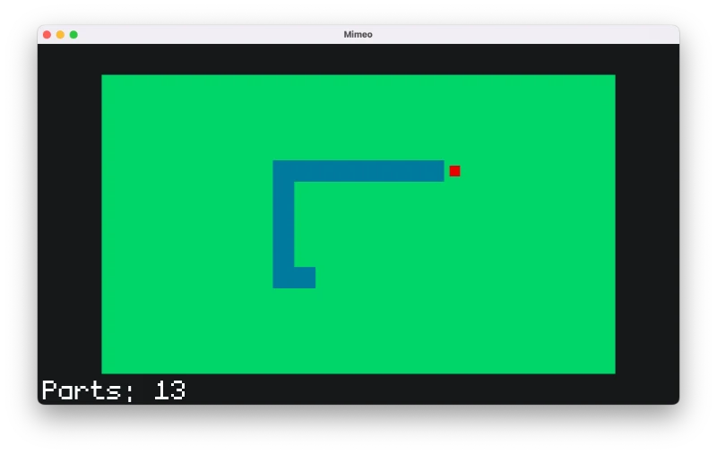

# Snake

**The gist**: build a game where you move a snake around a field eating apples. The snake grows with each apple eaten. And if the snake collides with itself, its game over.

Snake is great introduction to tile-based gameplay. It's got short play sessions, simple rules, and is quite replayable. I remember playing it on my mom's Nokia smartphone in the car when I was a kid and continually having a blast.

## Mock-Up

The graphics can be as simple as a square for the snake's parts and the apples. Here's a snake clone I made:

## Specs

- Snake head moves around field automatically
- Loops back to the other side when it goes off screen
- Arrow keys change the movement direction and the rest of the body follows
- Apples spawn randomly on the field
- When snake head overlaps with apple, the apple disappears and the snake grows a new part
- When the snake's head collides with any part of its body, the game is over
- Allow the player to restart

## Concepts

- Tile-based movement
- Random spawning
- Collision detection
- Increased difficulty

## Extra Credit

- Keep track of parts grown and display at the end
- Keep track of high score
- Increase the snake's movement speed the longer it gets (more apples = more energy = more speed)
- Add music and sound effects
