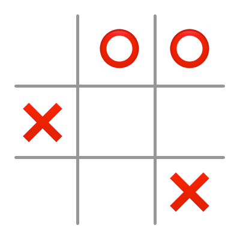

# Tic-Tac-Toe

**The gist**: build a digital version of Tic-Tac-Toe (a.k.a. Noughts and Crosses, Xs and Os).

Tic-Tac-Toe (TTT) a traditional paper-and-pencil game for two players. One player plays Xs, the other Os. They alternate turns placing their shape in a 3x3 grid. The first two connect three in a row in any direction wins.

## Mock-Ups

The game board and assets can be as simple as four lines and the O and X graphics:

## Specs

- Player chooses to be Xs or Os
- Xs goes first
- Draw the 3x3 grid
- Computer chooses an open tile at random
- Alternate turns
- Check after each play to see if there's a winner
- If no moves are available, game over

## Concepts

- Rendering a grid
- Basic game logic
- Simple AI

## Extra Credit

- Add support for playing with another person next to you
- Networking support for multiplayer if you want to explore that realm

## References

- [📺 How to Play Tic-Tac-Toe](https://www.youtube.com/watch?v=5SdW0_wTX5c)
- [Wikipedia page on TTT](https://en.wikipedia.org/wiki/Tic-tac-toe)
