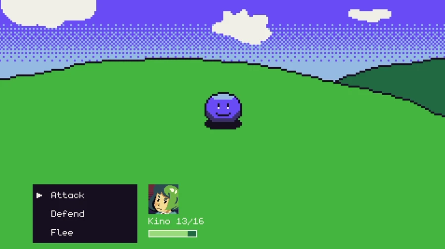

# Turn-Based Battle System

**The gist**: build a combat system for a turn-based RPG.

My favorite game series is _Dragon Quest_. I absolutely love it. The art, the chilled out gameplay of exploring and fighting monsters, the music. I also go back to wanting to make a game just as fun as the _Dragon Quest_ series.

Building a turn-based combat system like those found in classic JRPGs like _Final Fantasy_, _Pokémon_, and _Dragon Quest_ is a great way to build a focused system of a game that can be expanded upon incrementally.

Once you've got combat working, you can add a map field to explore and enter combat. You're pretty close to a playable game at that point!

I think of this game idea as... what if you had an RPG where you just fought the final boss right at the beginning? It'd be a fun exercise in learning.

## Mock-Ups

## Specs

- Player chooses to attack or defend
- Player action plays out
- Enemy randomly chooses to attack or defend
- Enemy action plays out
- Keep track of player and enemy health
- Whoever reaches 0 health first loses

## Assets

Here are assets from the screenshot above that you can use if you don't find or make your own:

Background:

Player character avatar:

Enemy sprite with simple animation:

Cursor for use in menu (tough to see on white backgrounds):

## Concepts

- Turn-based battle system
- Basic enemy AI
- Menus

## Extra Credit

- Add items
- Add spells
- Add multiple characters in the player's party
- Add multiple enemies
- Make the combat more challenging but not impossible
- String together a series of battles

## References

[📺 Battle gameplay in _Dragon Quest XI_](https://youtu.be/Yg7ByRpbsqA?t=64)
- Games to play with turn-based battle systems:
  - _Pokémon_
  - _Final Fantasy_
  - _Dragon Quest_
