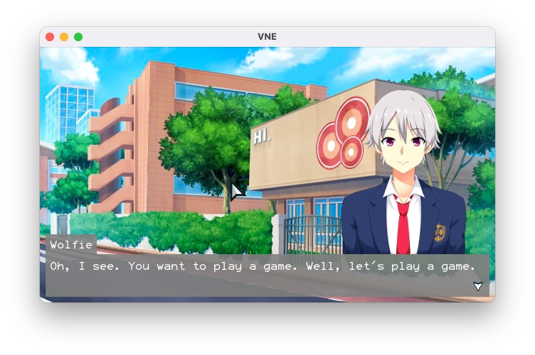

# Visual Novel

**The gist**: build a game that renders text and associated images, à la digital picturebook.

Visual Novels (VN) are a great genre of game for those looking to make something that's more focused on the story than the gameplay. Visual Novels often make use of anime-style graphics, but the sky's the limit here. You can do what you want. The basic gist is that there's text rendering, image rendering, and usually light forms of player input.

## Mock-Up

Here's a screenshot of what the interface for the game could look like:



This screenshot is rendering a background image, [a character sprite (by Sutemo)](https://sutemo.itch.io/male-character-sprite-for-visual-novel), and a textbox with a name and dialogue.

I wrote an extremely simple scripting language in a text file that the game parses and reads:

```
!fadeOut
!bg modern-street.jpg
!fadeIn
We find ourselves witnessing a conversation between two friends.
...
Wolfie: Hello, what are you doing here?
Wolfie: Oh, I see. You want to play a game. Well, let's play a game.
Wolfie: Guess what number I'm thinking...
Bunny: Let me think. Just give me a moment.
Bunny stares at the ground.
...
Bunny: Okay! 6!
!flash
!shake
Wolfie: Correct-o-mundo!
!fadeOut
!bg room-night.jpg
!fadeIn
End scene!
*The audience claps.*
```

For starting out, I wouldn't necessarily worry about having a custom scripting language, but instead just code the steps of the VN in the language you're working in.

## Concepts

- Scripting
- Rendering graphics

## Specs

- Render text in a textbox
- Render a background image
- Render the avatar of the currently speaking character
- Progress through chunks of text with clicks or taps or input
- Player choice that changes the outcome

## Extra Credit

- Support loading the dialog, images, input, logic, etc. via a scripting language—define your own or add support for Lua (or something else)
- Hot reload scripts in the game so you don't have to relaunch it when it changes
- Game saves
- Add music and sound effects

## Resources

- [Ren'Py](https://www.renpy.org/) — popular open source visual novel engine built in Python
- [Monogatari](https://monogatari.io/) — web-powered visual novel engine
- [Visual Novel assets on Itch.io](https://itch.io/game-assets/free/genre-visual-novel)