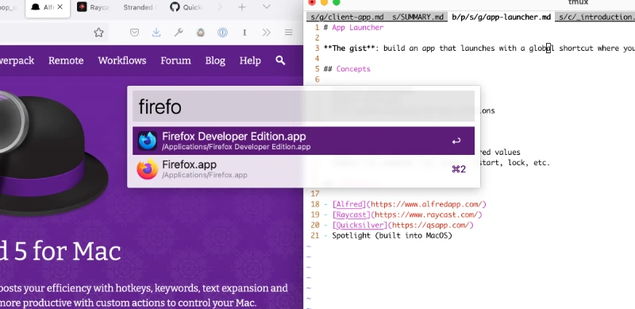

# App Launcher

**The gist**: build an app that launches with a global shortcut where you can type in an app to open.

## Example

Here's a screenshot of the Alfred launcher I use:

## Concepts

- Desktop development
- Global shortcuts
- File system browsing for app locations

## Extra Credit

- Keep track of launches and rank those more often used higher
- Support math calculations for entered values
- Support OS commands like sleep, restart, lock, etc.
- Find and open files on the disk

## References

- [Alfred](https://www.alfredapp.com/)
- [Raycast](https://www.raycast.com/)
- [Quicksilver](https://qsapp.com/)
- Spotlight (built into MacOS)
