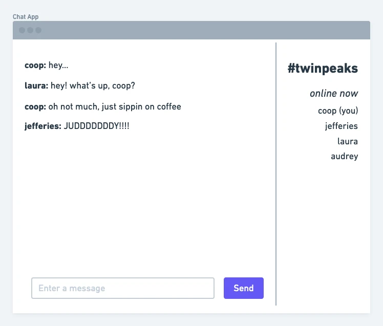

# Chat App

**The gist**: build an app that let's two or more people chat with instant messages in a room.

In the days before Slack and Discord there was IRC and AIM for chatting with friends (and strangers too). It was a stable of my time on the computer growing up. I've never built a chat room or instant messaging app before, but I'd like to. There are certain challenges with it, like ordering messages, sending and receiving, and storing all of the data.

## Mock-Ups

## Spec

- Users can join a room with a handle to represent them (a URL or channel name)
- Users can post messages
- Messages are persisted
- Users can read messages already posted

## Concepts

- Instantaneous, propagated communication
- Data storage
- Networking

## Extra Credit

- @handle support to ping someone
- Multiple rooms
