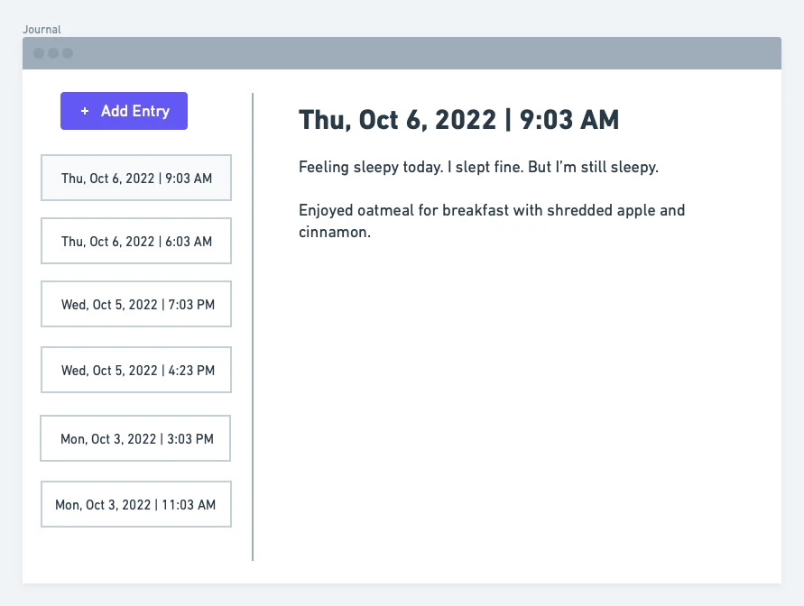

# Journal

**The gist**: build an app for capturing memories.

Start out by building an app that lets you make text entries in your journal. Simple enough! Title them by the date and the time of creation. Have it be a little text log.

How the data is stored is up to you. It could be as simple as `txt` files on the file system or in a database. There are pros and cons to any choice for this.

## Mock-Ups

Here's what a simple version of the UI could look like:

## Specs

- Entry creation with text
- Render entries with the timestamp as the title
- Edit existing entries

## Concepts

- Text editing
- Data storage

## Extra Credit

- Search
- Tags to add some organization
- Location to associate more metadata
- Support image entries
- Support video entries
- Support Markdown
- Support rich text
- Sync entries across devices

## References

- [Day One](https://dayoneapp.com) — really fantastic journal app

## See Also

- [Notebook](./notebook.md) — more advanced/expanded version
