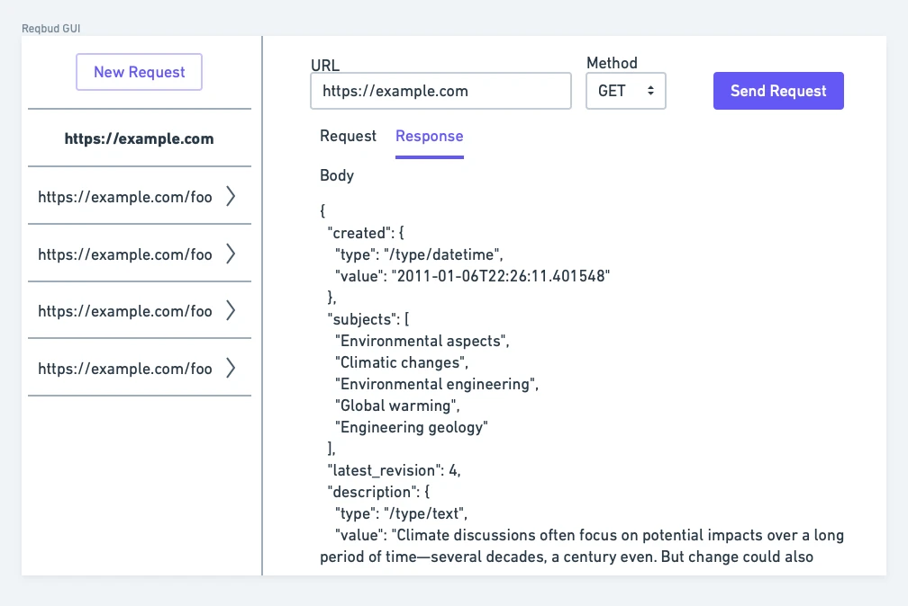

# Request Manager

**The gist**: build an app that allows you to manage a library of HTTP requests with response display.

When building or integrating with an API, it's helpful to be able to organize a collection of API requests and view the responses to see how the API is behaving. This app would allow users to create request objects with a URL, relevant header information, and any body contents that then get sent along. The response, including the body, is then rendered.

I think this would be ideal as a desktop GUI app.

## Mock-Ups

The GUI, especially for a basic version, could be as simple as:

The left column has the requests displayed. You select one and it renders the details in the main pane. There the request details can be specified and the response can be rendered.

Grouping similar requests could be as simple as having different project files that get opened, closed, saved, etc.

## Specs

A very basic version would be to handle just GET requests:

- Create request objects
- Specify URL
- Make the request
- Display the response body (hopefully nicely formatted)

## Concepts

- Making requests
- Parsing responses
- HTTP
- Desktop GUI

## Extra Credit

- Support other HTTP verbs (PUT, POST, DELETE, etc.)
- Specify headers
- Specify body
- Group together requests
- Specify shared variables for grouped requests
- Save the response body to the computer
- Build a flavor of this specifically tailored for GraphQL requests and schema reading

## References

- [Paw](https://paw.cloud)
- [Postman](https://www.postman.com)

## See Also

- [HTTP Client](../libraries/http-client.md)
- [httpal](../command-line-interfaces/httpal.md)
