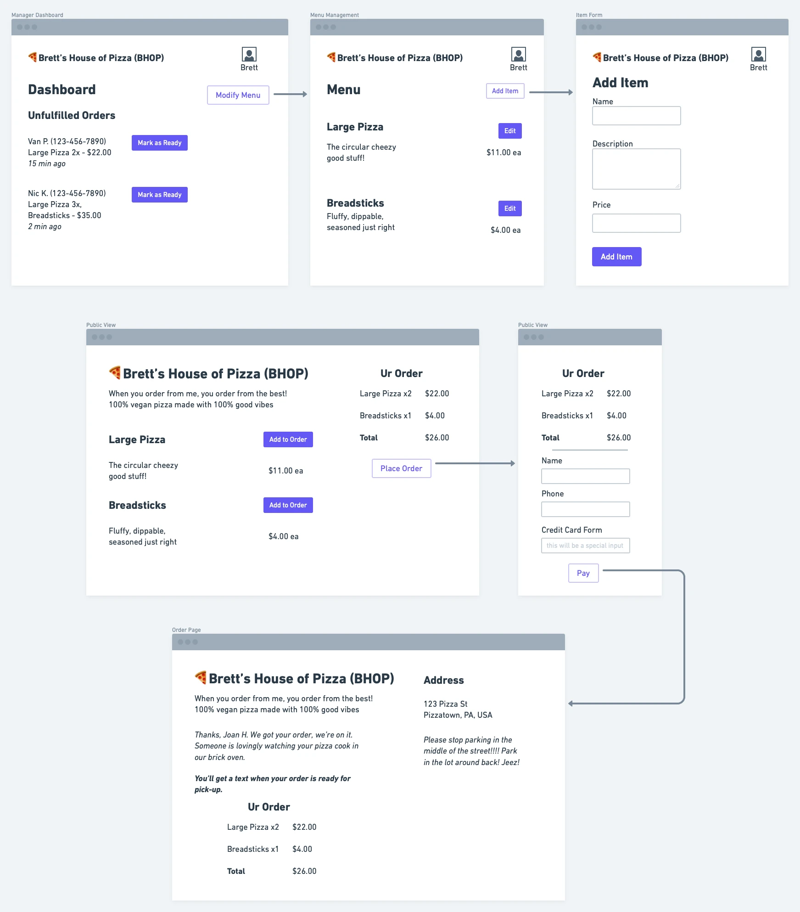

# Restaurant Ordering Platform

**The gist**: allow restaurants to define menu items and then allow patrons to place orders from that menu online for pick-up.

The scope of this could really vary in its breadth! But the gist is to create a web app that allows restuarants to create a website that lets their patrons order online for pick-up. It would allow them to add menu items with their price and optional description.

## Mock-Ups

## Specs

- Restaurant manager signs up
- Restaurant manager adds menu items with name, price, and description
- Patrons can view the website for the restaurant
- Add menu items to their order
- Pay for it to place the order
- Restaurant gets notified of the order
- Restaurant can view order details in a Dashboard for making the food
- Restaurant can then mark the order as ready for pick-up, notifying the patron via text

I'd call this GrubBud, or maybe that's too close to the real thing. How about iMenu and get all 2000s Steve Jobs on it??? Call it what ya' want! Or maybe PickMeUp! I like that.

## Concepts

- Admin for restuarant to manage their menu
- Public website for ordering w/ a cart with line items
- Payment processing
- State managing for the order with effects at various state changes (sounds like a state machine to me!)

## Concepts

- Authentication for restaurant menu management
- Authorization
- Payment Processing
- State management
- Notifications
- Third-party APIs

## A Note on Scope

This is basically a full stack web app. For learning purposes, you could have it just be for one restaurant with HTTP basic auth for the Admin area. Or build out an entire sign up flow! Whatever you want.

But there's a lot to this. So start easy. Maybe the payment processing is a bit advanced. Fake it! Then doing some learning and build it out.

If I was an educator who was teaching a course or writing a book on building web apps, I would use this as a class project because it is non-trivial, has levels of access control, includes interacting with APIs for payment process and notifications, has state management, and very likely has a database. It's also not just another blogging engine or Twitter clone or todo app. Plus! A lot of people can relate to and understand the concepts behind this because they've placed orders for food online. And if they haven't, if they've eaten out, the concepts are close enough to map to the technological needs.

## Stretch Goals

- Order receipt web page with current status, could even poll or use websockets
- Allow photos to be uploaded for each menu item
- Add variants to menu items (like size, various options, etc.)
- Reorder menu items
- Tax because ugh tax
- Menu sections to group items together
- There are so many business needs that could exist to make this more complex:
  - Only accept orders when restaurant is open
  - Line item customizations/requests
  - Upload restaurant branding
