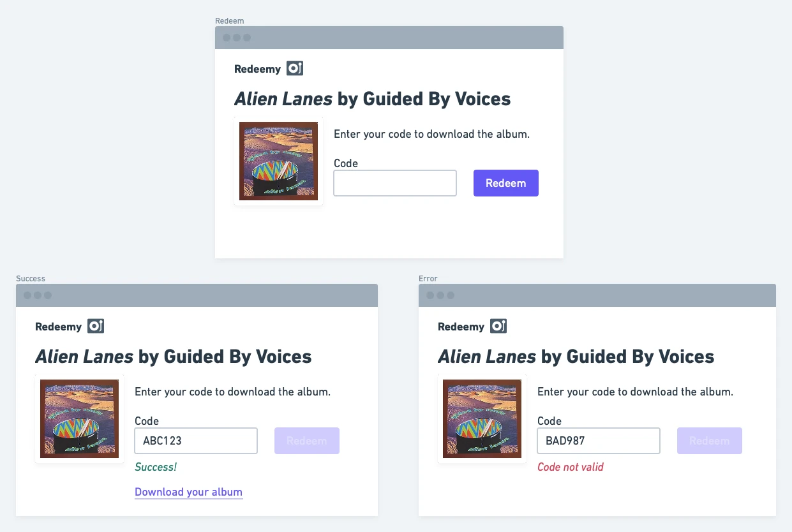

# Vinyl Download Code Redeemer

The Gist: users can enter a code they received with their vinyl purchase to download the digital version of the album.

I'd call this project Redeemy! It's make a good open source app.

Redeemy does not just have to for music downloads. It could be any digital file. It's a nice app for learning in that it can be pretty simple to start but expanded to be quite complex.

## Mock-Ups

Here's what the redemption UI could look like for a given item:

Now it's worth noting that the redemption page might be generic and not display the item attempting to be redeemed. That all depends on URL structure and how everything works. For the basic version, do whatever you want and have fun with it!

## Spec

- Host a file on your computer or online storage
- Build a web page for redeeming a code
- If the entered code matches what you hard code in the back-end, then download the file
- If the entered code doesn't match, display an error

## Concepts

- Validating input
- Delivering files

## Extra Credit

- Build out an admin for musicians (or whomever) to sign in and upload their albums
- Add ability to generate codes
  - Ensure there are no duplicates when generating
  - What code structure can you use to ensure millions or billions of unique codes can be generated?
  - Beware of similar-looking characters like 0 (zero) and O and 1 and l
- Expire codes after use
- Allows codes to be redeemed N times
- Allow files to be downloaded N times
- Display multiple files for download
- Render a grid of generated codes with print-friendly styles
- The infrastructure is set up for distributing digital files... what if there was some way to sell directly to people?

## Examples

- [Bandcamp's redemption UI](https://bandcamp.com/yum)
