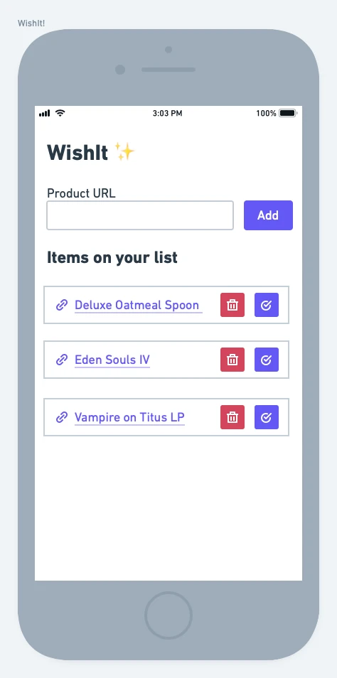

# Wishlist

**The gist**: A web app and/or API for adding products across various online shops to a common wishlist.

I've done a little online shopping in my life! I've done a little online window shopping too. I like saving things I'm interested in and coming back to it later to see if I'm still interested. But I don't have a good way to maintain that list and mark items as purchased across any given website. Enter: WishIt! ✨

Okay, that's kind of a silly name. But naming all of these projects is no easy task.

## Spec

- You'll need authentication for this (or just store data in `this.localStorage`)
- Have a simple form for entering URL to add it to the wishlist
- Validate the URL
- Parse the title from the web page of the URL for the item's name
- Save the item to the user's wishlist
- Allow items to be:
  - Marked as purchased
  - Deleted

## Concepts

- Crawling a web page
- A todo app that isn't a todo app

## Mock-Up

Here's what the interface could look like:

As you can see, it's pretty simple to start, which is nice. It's the fetching the data from the web page that's a bit more of a challenge with this project.

## Extra Credit

- Parse out additional info like the title, photo, price, and description from the URL
  - Supporting this for any given website can be challenging, so pick one or two to start
  - Some pages might have Open Graph tags for products, which would make this a lot easier, [reference](https://developers.facebook.com/docs/payments/product/)
- Build out a browser extension that takes the current URL and submits it to the current user's WishIt ✨
