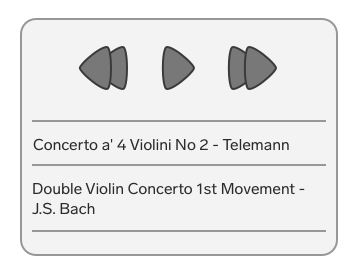
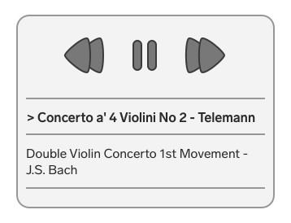

# Music Player (Web Component)

**The gist**: build a web component for playing one or more music files.

HTML5 has [rich events](http://developer.mozilla.org/en-US/docs/Web/HTML/Element/audio) for interacting with audio. A web component that takes children that are audio files and then can play through them and handle common functionality like:

- Play
- Pause
- Volume
- Next/previous song
- Pick and play a track
- Play the next song in the list

## Concepts

- HTML5 audio API
- Rendering the GUI for listing the tracks
- Rendering the GUI for the actual player
- Callbacks for various audio events

## Spec

The mark-up could be something like this:

``` html
<music-player>
  <mp-song>
    <source src="horse.ogg" type="audio/ogg">
    <source src="horse.mp3" type="audio/mp3">
  </mp-song>

  <mp-song>
    <source src="cat.ogg" type="audio/ogg">
    <source src="cat.mp3" type="audio/mp3">
  </mp-song>
</music-player>
```

## Mock-Up

Here's what the UI could look like.

When no song is selected and nothing is playing:



When a song is selected and is currently playing:



Tapping on the \>\> arrows would play the next song. Tapping \<\< would go back a song.

## Resources

Here are four SVG icons (public domain, CC0) I made that you can use (or find your own icons):

- Play: [](./img/play.svg)
- Next: [](./img/next.svg)
- Prev: [](./img/prev.svg)
- Pause: [](./img/pause.svg)

Use your own audio files or [download public domain Classical music files](https://www.freemusicpublicdomain.com/royalty-free-classical-music/).

## Tech

Lit and Stencil and Svetle interest me in particular for this. I think it'd need to be easy to load into any given web page or app.

## Stretch Goals

- Song progress bar
- Ability to scrub through a song
- Loop through the playlist
- Shuffle
- Easy download for the files if someone enjoys them

## See Also

- [Video Player](./video-player.md)
