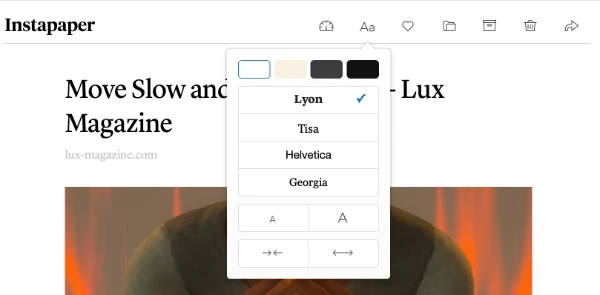

# Prose Renderer

**The gist**: build a web component that allows readers to configure text rendering options to make prose easier to read.

I tend to think of this as a library or component called `Prose.js` or `Reader.js` that is concerned with taking a nested collection of `<p>` elements in particular and rendering them in a way that gives the user fine grain control over how it's rendered. Their preferences would be stored in `localStorage` so upon refresh their settings would load and be used across web pages (like chapters in a book).

The Kindle device and apps have decent control settings for this, as does Wattpad.

## Mock-Ups

I've put together a simple mock-up of what this could be like:


When the Text Settings button is pressed, it opens the widget. When it's pressed again, it closes it.

When the widget is open, tapping the settings automatically changes the text that's being rendered.

Due to limitations in the mock-up tool, I can't easily change the font or make the text justified, but I think the mock-up covers the gist.


## Spec

Configuration options:

- Text size
- Text alignment — justified or left aligned or right aligned

Usage:

1. include the script to load the source for the component
2. just use the component! wrap the output for the prose in the component:

``` html
<Prose>
  <p>It was a dark and stormy night...</p>
  <p>More stuff! More stuff!</p>
</Prose>
```

## Tech

Any of the major web component libraries are appealing for this, in particular ones that can generate a portable component that can be easily loaded and dropped in like Stencil. Svelte and Lit appeal to me too.

## Concepts

- Working with `localStorage`—writing and reading
- Building out a non-intrusive UI
- Overriding/applying styles to nested content

## Reference

Here's a screenshot of [Instapaper](https://instapaper.com)'s web text settings:



## Extra Credit

- Support additional settings
  - Line spacing
  - Different fonts
  - Margins
