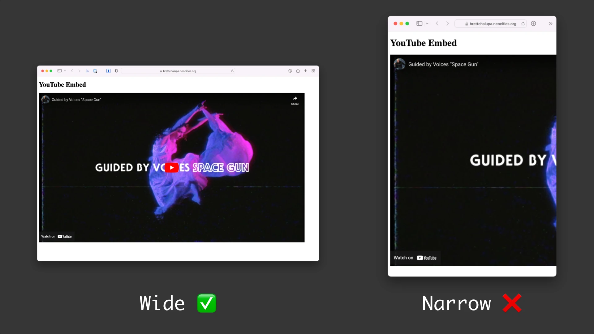

# Responsive YouTube Video Embed

This is a really simple little project and component. It's basically just a way to take a YouTube video and embed it in a resilient way that can be responsive since that tends to be an issue when it comes to their default embed. It usually requires a CSS snippet, but it'd be nice to not need that and instead have an easy way to embed a YouTube video.

Also, it'd make it possible to take the YT video URL or just the ID and render it accordingly.

YouTube's embed snippet they provide looks like this:

```
<iframe width="560" height="315" src="https://www.youtube.com/embed/logjpKitcLo" title="YouTube video player" frameborder="0" allow="accelerometer; autoplay; clipboard-write; encrypted-media; gyroscope; picture-in-picture" allowfullscreen></iframe>
```

You can see it hardcodes the width and height, which is not what we want. We instead want the video to be as wide as its container or specified width, and then for it to reduce in width on smaller viewports while maintaining its aspect ratio.

This image illustrates the main problem with YouTube's default embed code with larger sizes:



## Spec

Specifying via just the video ID:

```html
<yt-vid id="logjpKitcLo" />
```

Supporting the full video URL, which it'd be nice to easily parse out:

```html
<yt-vid id="https://www.youtube.com/watch?v=logjpKitcLo" />
```

Supporting the embed URL just because:

```html
<yt-vid id="https://www.youtube.com/embed/logjpKitcLo" />
```

This would output a responsive YouTube embed that resizes with the browser. Here's a diagram:


## Concepts

- Packaging and distributing a web component
- Parsing out relevant info from a string
- Responsive iframes
- Supporting an existing API (YouTube's embed API)
- Maintaining aspect ratio when resizing

## Extra Credit

- Support YouTube's various URL params for things like start time and whether or not to use the privacy enhanced mode.
- Properties for specifying max-width or just width of the video
